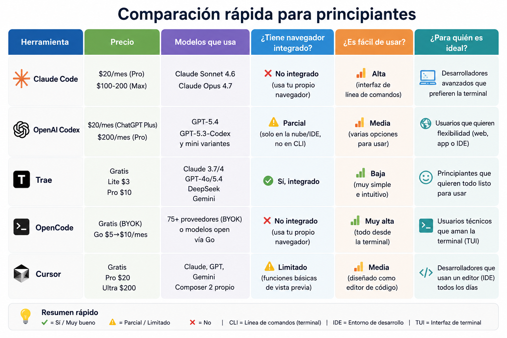
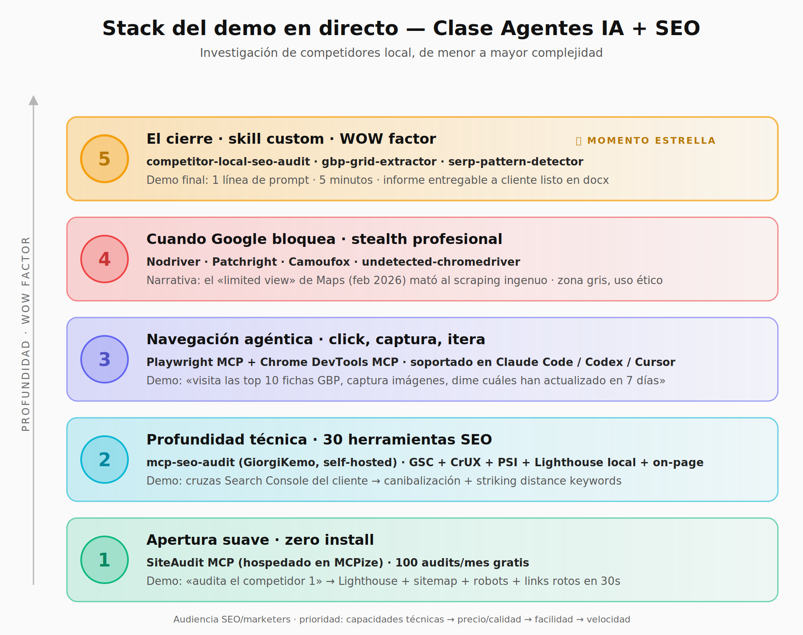

# Clase 1 · Agentes IA para SEO y webs hiperoptimizadas

> 📚 **YinyangSEO Academy · Itinerario de Agentes IA · Clase 1**
> *Aprendemos a hacer webs **agénticas** y **SEO eficientes**.*
> Audiencia: SEOs y marketers que tocan código a ratos.

> No vamos a aprender nombres de IAs.
> Vamos a aprender a montar un **sistema** para investigar, crear, probar y optimizar webs con agentes.

---

## 📥 ¿Eres alumno? Empieza por aquí

👉 **[EMPEZAR-AQUI.md](EMPEZAR-AQUI.md)** — guía paso a paso: descargar el repo, abrirlo en tu agente, primer prompt y ejemplos por fase.

**Resumen rápido:**

1. **Descarga** el repo: `<> Code` → **Download ZIP**, o `git clone https://github.com/Freskan23/clase-1-agentes-ia-webs.git`.
2. **Abre la carpeta** con tu agente (Trae SOLO / Cursor / Windsurf / Claude Code) como workspace.
3. **Pídele que lea** `README.md` y `ROADMAP.md` antes de empezar.
4. **Vuelve** cada vez que avancemos en el curso (`git pull` o re-descargar ZIP).

---

## Índice rápido

| Sección | Contenido |
|---------|-----------|
| 🚀 [**EMPEZAR AQUÍ**](EMPEZAR-AQUI.md) | Guía para alumnos: descarga, primer prompt y ejemplos por fase. |
| 🗺️ [**ROADMAP del itinerario**](ROADMAP.md) | Flujo end-to-end desde *investigación* hasta *deploy*. |
| [00 · Comparativa de agentes](00-comparativa-agentes/) | Trae SOLO, Windsurf, Cursor, Claude Code, Codex, OpenCode. Criterio de elección. |
| [01 · Diccionario técnico](01-diccionario/) | Repo, branch, MCP, tokens, skill, dev server, deploy, BYOK, sandbox… |
| [02 · Investigación de competidores](02-investigacion-competidores/) | Stack en 5 niveles + repos stealth + advertencia ética. |
| [03 · Skills custom](03-skills/) | **10 skills** del flujo completo (ver tabla abajo). |
| [Apuntes de la clase](apuntes/apuntes-clase.md) | Recorrido en prosa por las 25 diapositivas. |
| [Glosario](apuntes/glosario.md) | Definiciones rápidas. |
| [Ejercicio del grupo (10 min)](apuntes/ejercicio.md) | Caso “web local por servicio + barrio”. |
| [Checklist pre-construcción](apuntes/checklist.md) | Lo mínimo claro antes de la práctica. |
| [Recursos y enlaces](recursos/enlaces.md) | Agentes, MCPs, navegadores cloud, scrapers, Astro starters, schema, performance. |
| [Presentación (.pptx)](presentacion/clase_1_agentes_ia_webs_hiperoptimizadas_v2_con_notas.pptx) | El deck con notas. |

### Skills disponibles en `03-skills/`

| # | Skill | Estado | Fase |
|---|-------|:------:|------|
| 1 | [`local-pack-multi-city`](03-skills/local-pack-multi-city/SKILL.md) | 🟡 STUB | Investigación |
| 2 | [`serp-pattern-detector`](03-skills/serp-pattern-detector/SKILL.md) | ✅ MADURA | Investigación |
| 3 | [`gbp-grid-extractor`](03-skills/gbp-grid-extractor/SKILL.md) | ✅ MADURA | Investigación |
| 4 | [`gbp-deep-profile`](03-skills/gbp-deep-profile/SKILL.md) | 🟡 STUB | Análisis |
| 5 | [`web-pattern-extractor`](03-skills/web-pattern-extractor/SKILL.md) | 🟡 STUB | Análisis |
| 6 | [`competitor-local-seo-audit`](03-skills/competitor-local-seo-audit/SKILL.md) | ✅ MADURA | Análisis |
| 7 | [`local-seo-pattern-aggregator`](03-skills/local-seo-pattern-aggregator/SKILL.md) | 🟡 STUB | **Patrones** |
| 8 | [`web-blueprint-generator`](03-skills/web-blueprint-generator/SKILL.md) | 🟡 STUB | Blueprint |
| 9 | [`landing-generator-servicio-barrio`](03-skills/landing-generator-servicio-barrio/SKILL.md) | 🟡 STUB | Generación |
| 10 | [`landing-qa-runner`](03-skills/landing-qa-runner/SKILL.md) | 🟡 STUB | QA + Deploy |

> ✅ **MADURA** · lista para usar con un caso real.
> 🟡 **STUB** · estructura completa (objetivo, inputs, proceso, output, QA) para que tu agente la implemente. Iremos puliéndolas en clases siguientes.

---

## Idea central

La clase no va solo de “qué agente usar”. La idea es que el alumno entienda **cómo se monta un sistema de trabajo con agentes**:

1. **Elegir la superficie** adecuada: chat, CLI, IDE o builder visual.
2. **Entender el vocabulario** técnico mínimo.
3. **Usar repositorios** de GitHub como contexto, plantilla y código reutilizable.
4. **Conectar herramientas** mediante MCPs, APIs y navegador.
5. **Convertir procesos repetibles** en *skills*.
6. **Aplicarlo a un caso real**: investigación de competidores locales.

Narrativa: de **menor a mayor complejidad** — primero seguridad y claridad, después herramientas, después automatización, y al final el “wow factor” de una skill custom.

---

## Mapa visual

| | |
|--|--|
|  |  |
| Comparativa de agentes | Stack de investigación · 5 niveles |

---

## Estructura de la clase

La clase está pensada para recorrerse en este orden:

1. **Comparativa de agentes** → elegir herramienta según perfil y fricción, no según moda.
   *La barrera principal no es el modelo, es la superficie.*
2. **Diccionario técnico mínimo** → repo, branch, MCP, tool call, tokens, dev server, deploy, BYOK…
3. **GitHub como biblioteca** → un repo no es solo código, es memoria técnica del proyecto y contexto para tu agente.
4. **Stack de investigación SEO** (5 niveles, de suave a pro): SiteAudit MCP → mcp-seo-audit → Playwright/DevTools → repos stealth → skill custom.
5. **Qué es una skill** → un proceso repetible con inputs, pasos, herramientas, salida y QA. *No es un prompt largo.*
6. **Las 10 skills del flujo** → de la investigación SERP a la web desplegada. Ver [tabla arriba](#skills-disponibles-en-03-skills) y [ROADMAP](ROADMAP.md).
7. **Ejercicio + checklist** → [`apuntes/ejercicio.md`](apuntes/ejercicio.md) · [`apuntes/checklist.md`](apuntes/checklist.md).

---

## Filosofía

> *El stack se vuelve obsoleto cada 3 meses. Por eso el valor no es “este script”. El valor es tener **criterio + sistema** para adaptar herramientas sin perderte.*
>
> *El agente acelera; el criterio lo pones tú.*

---

## Licencia

Material formativo del itinerario **YinyangSEO**. Consulta [`LICENSE`](LICENSE).

🤖 ¿Erratas o propuestas? Abre un *issue* o un *pull request*.
