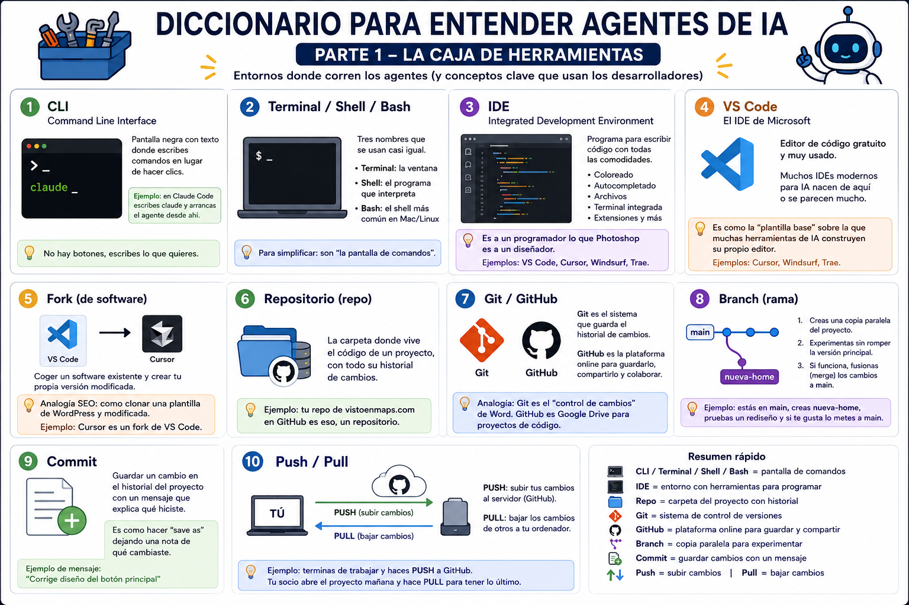
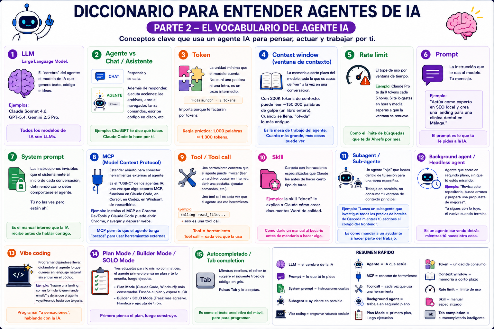
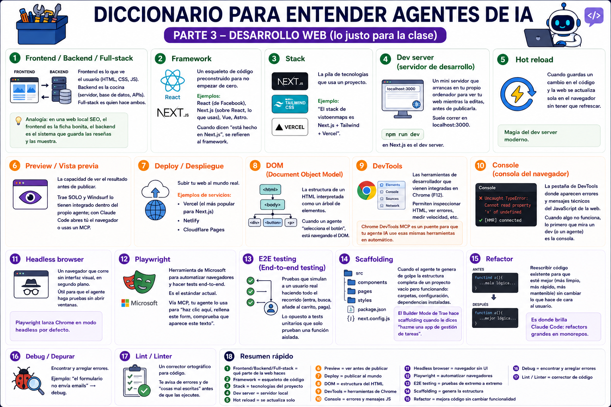
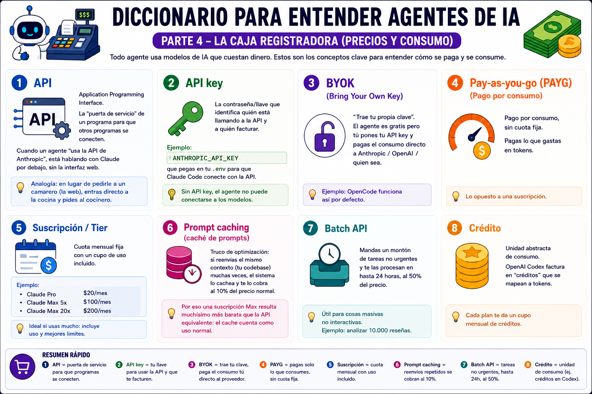
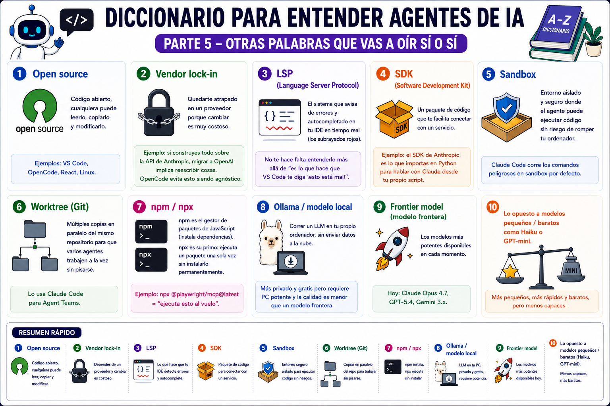

# Apuntes de la Clase 1

> 90 min · YinyangSEO · Itinerario de Agentes IA
> Recorrido en prosa por las 25 diapositivas.

---

## 1 · Apertura

Webs que **posicionan muy bien**, hechas con **código**, pero **generadas y mantenidas por un agente**.

No venimos a memorizar nombres. Venimos a entender **piezas conectables**. Si entiendes las piezas, construir webs es solo ejecutar un flujo.

---

## 2 · Mapa de la clase

**Hoy entendemos:**

1. Qué es un agente (vs chat).
2. Superficies (chat / CLI / IDE).
3. Costes (tokens, suscripción, API).
4. Repos (GitHub / TickHat) como biblioteca.
5. MCPs / APIs como “manos”.
6. Skills como procesos repetibles.

**Hoy NO hacemos:**

- Instalar 20 cosas.
- Debatir el modelo perfecto.
- Scraping por deporte.

> Hoy buscamos base común. La práctica de webs viene después y será más rápida.

---

## 3 · Modelo mental: Chat vs Agente vs Automatización

Misma IA por detrás, pero distinta capacidad operativa.

| **Chat** | **Agente** | **Automatización** |
|----------|-----------|--------------------|
| Responde y se calla. | Lee tu carpeta. | Corre sin ti. |
| No toca archivos. | Escribe código. | Mismo proceso cada vez. |
| No navega. | Arranca un dev server. | Entregable definido. |
| No ejecuta. | Abre navegador y prueba. | Para mantenimiento y reporting. |
|  | Itera hasta que funcione. |  |

> El valor del agente es que puede **verificar** (navegador / terminal), no solo escribir bonito.

---

## 4 · La barrera real: la “superficie” manda más que el modelo

Para audiencia no técnica, **ganan las herramientas con preview y navegador integrados**.

| **Chat (web/app)** | **IDE con IA** | **All-in-one con preview** |
|--------------------|----------------|----------------------------|
| Rápido para idear. | Editor + archivos. | Editor + terminal + navegador. |
| Cuesta validar. | Mejor para iterar. | Mínima fricción. |
| Terminas copiando/pegando. | A veces hay que configurar. | Ideal: “agente hace la web y yo la reviso”. |

> Si la gente se asusta con la terminal, evita CLI como herramienta principal en la primera práctica.

---

## 5 · Comparativa: cómo decidir sin humo

Lo importante: **fricción, preview, navegador, MCPs, coste y perfil**.

**Cómo se lee la tabla:**

1. ¿Tiene preview?
2. ¿Tiene navegador?
3. ¿Soporta MCP?
4. ¿Cuánto cuesta entrar?
5. ¿Para qué perfil?

> ⚠️ Confirma precios 24 h antes de la clase. Cambian rápido.

→ Documento completo: [`00-comparativa-agentes/comparativa-agentes-ia.md`](../00-comparativa-agentes/comparativa-agentes-ia.md)

---

## 6 · Diccionario mínimo

Para que nadie se pierda con repos, MCPs, tokens y deploy.

| Parte | Imagen |
|-------|--------|
| 1 · Caja de herramientas |  |
| 2 · Vocabulario del agente |  |
| 3 · Desarrollo web |  |
| 4 · Costes y consumo |  |
| 5 · Conceptos extra |  |

> 3 definiciones que conviene grabar:
> - **Repo** = carpeta + historial + instrucciones.
> - **MCP** = “USB-C” de herramientas para agentes.
> - **Tokens** = unidad de coste (no magia).

→ Documento completo: [`01-diccionario/diccionario-conceptos.md`](../01-diccionario/diccionario-conceptos.md)

---

## 7 · Costes: cómo pensar el gasto sin asustarse

**Regla 1 · El coste es (entrada + salida).**
Leer repos y docs → tokens de entrada. Generar código / texto → tokens de salida. La salida suele ser lo caro.

**Regla 2 · Valida pronto (preview).**
Evita 10 iteraciones “a ciegas”. Si puedes ver la web, corriges antes. Menos reintentos = menos tokens.

**Regla 3 · Automatiza lo repetible.**
Lo que haces 20 veces → conviértelo en *skill*. Reduce improvisación y reduce coste por re-trabajo.

> No te obsesiones con tokens; sí con evitar **bucles inútiles**.

---

## 8 · Traducción de jerga: Prompt vs Skill vs MCP vs API

| **Prompt** | **Skill** | **MCP** | **API** |
|------------|-----------|---------|---------|
| Una instrucción. | Un procedimiento repetible. | Un conector. | Datos oficiales. |
| Pide una respuesta. | Incluye pasos y QA. | Enchufa herramientas (“USB-C de agentes”). | Pagas por uso. Reduce scraping. |

> Mini test: ¿qué es el USB-C? → **MCP**.
> Criterio: si hay API oficial razonable, **mejor que scraping**.

---

## 9 · Repositorios: GitHub (y TickHat) como biblioteca

Para un agente, un repo es **memoria + instrucciones + piezas reutilizables**.

**Cómo se usa un repo dentro del flujo:**

1. **Encontrar** (template, ejemplo, repo interno).
2. **Entender** (README, scripts, decisiones).
3. **Adaptar** (solo lo necesario).
4. **Probar** (dev server + navegador).
5. **Versionar** (commits para volver atrás).

**Repos TickHat (idea general).** Catálogo de:

- Plantillas de webs SEO.
- Componentes (FAQ, tablas, comparadores).
- Scripts de research / QA.
- Checklists y estándares.

> El agente no copia: **entiende, reutiliza y prueba**.

---

## 10 · Herramientas para el agente: MCPs + APIs + navegador

Sin herramientas, el agente alucina más. Las herramientas son **verificación**.

### Stack de investigación de competidores · 5 niveles

A más nivel: más profundidad, más control… y más responsabilidad.

> No es para memorizar. Es una **escalera**: empieza en 1 (bajo riesgo) y solo sube si necesitas más.

→ Documento completo: [`02-investigacion-competidores/investigacion-skills-repos-mcps.md`](../02-investigacion-competidores/investigacion-skills-repos-mcps.md)

---

## 11 · Límites: scraping, bloqueos y zona gris

**Lo responsable:**

- Prioriza **APIs oficiales** cuando existan (Places, Search Console, PageSpeed).
- Navega como humano cuando haga falta (Playwright / DevTools).
- Usa **scraping stealth solo con contexto, permisos y límite claro**.
- Explica riesgos al cliente y documenta decisiones.

> El stack se vuelve obsoleto cada 3 meses. El valor no es “este script”: es tener **criterio + sistema** para adaptar herramientas sin perderte.

---

## 12 · Skills: convertir prompts en procesos repetibles

### Anatomía

| Bloque | Qué define |
|--------|------------|
| **Objetivo** | Qué tarea resuelve, en una frase. |
| **Inputs** | Qué necesita antes de empezar (URLs, keyword, ciudad…). |
| **Proceso** | Pasos ordenados + decisiones (si pasa X, hago Y). |
| **Herramientas** | APIs, navegador, MCPs, terminal. |
| **Salida** | Formato esperado: docx, json, csv, cambios en repo. |
| **Calidad** | Cómo se valida: checks, comparativas, límites, warning de coste. |

> *Un prompt pide una respuesta; una skill define cómo trabajar.*

### 3 skills custom para SEO local

→ Carpeta: [`03-skills/`](../03-skills/)

| Skill | Qué hace | Salida |
|-------|----------|--------|
| [`competitor-local-seo-audit`](../03-skills/competitor-local-seo-audit/SKILL.md) | Competidores GBP + auditoría web + PageSpeed + schema + sitemap/robots. | Informe DOCX para cliente. |
| [`gbp-grid-extractor`](../03-skills/gbp-grid-extractor/SKILL.md) | Grid geográfico de rankings (estilo Local Falcon / GEOGRIDS). | Mapa + JSON. |
| [`serp-pattern-detector`](../03-skills/serp-pattern-detector/SKILL.md) | Patrones SERP: Map Pack, PAA, AI Overview, schema, freshness. | Hipótesis accionables. |

> Avisar de coste / tiempo antes de ejecutar grids o auditorías masivas.

---

## 13 · Puente a la práctica: flujo para crear webs que posicionan

| Fase | Qué hace el agente |
|------|---------------------|
| 1 · Research (SERP + competidores) | Genera y refina código. |
| 2 · Arquitectura (URLs, entidades, schema) | Mide (PageSpeed / Lighthouse). |
| 3 · Contenido (claridad + intención) | Navega y prueba. |
| 4 · QA (visual + performance) | Versiona (commits). |
| 5 · Deploy (publicar + medir) | Documenta decisiones. |

> Tú decides el **criterio**, no el agente.

---

## 14 · Autogestión: web autogestionable ≠ web sin código

Autogestionable significa **cambiar contenido sin romper rendimiento ni SEO**.

| **Markdown / MDX** | **Headless CMS** | **Sheets / Airtable** |
|--------------------|------------------|------------------------|
| Contenido en ficheros. | Panel para editar. | Contenido en tablas. |
| Muy rápido. | El agente integra el CMS. | Perfecto para comparadores. |
| Ideal para landings y blogs. | Más cómodo para equipos. | El agente genera páginas. |
| Buen SEO y control total. | Requiere buen esquema. | Escala muy bien. |

> Autogestionable es un **requisito de producto**, no una tecnología.

---

## 15 · Ejercicio (10 min)

→ [`ejercicio.md`](ejercicio.md)

---

## 16 · Checklist antes de construir

→ [`checklist.md`](checklist.md)

---

## 17 · Cierre

Dos frases que se llevan a casa:

1. **Criterio > herramienta.**
2. **Sistema > prompts.**

> En la próxima clase: aplicar esto para **generar una web y validarla en navegador**.

---

📎 ¿Speaker notes con timings? → [`notas-instructor.md`](notas-instructor.md)
🔗 ¿Herramientas y enlaces? → [`../recursos/enlaces.md`](../recursos/enlaces.md)
